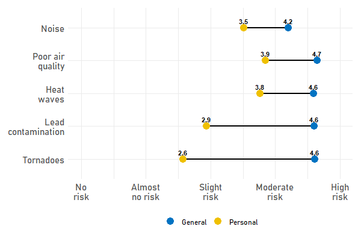

You might find that noise is a nuisance, possibly disrupting your sleep or preventing you from working effectively at home. But chances are that you also underestimate how much of a risk it is to you. 

Psychologists have been investigating risk perception for decades, after it became obvious that people don't make perceive risk based on a calculation of likelihood and severity. Instead, we rely on a gut feeling that psychologists call an affective heuristic or '*risk-as-feelings*'. Researchers have investigated how individuals perceive the risk of plenty of behaviours, technological hazards and natural events, for example smoking, nuclear power and tornadoes. But we've largely ignored the issue of noise exposure.

My work over the past few years has been to address this gap in our knowledge. We know that continuous exposure to noise has adverse effects on our health and well-being. What is less clear is the extent to which people recognize the importance of those adverse effects and have developed an affect-based perceived risk from noise. 

To find out, I asked a little over 2500 Montreal residents to rate the overall (general) risk of noise exposure and the extent to which they were at risk personally. I wanted to compare noise with other hazards, so each survey respondent also answered in a randomly chosen hazard from four possible ones: poor air quality, heat waves, lead contamination and tornadoes.

The perceived general risk of noise exposure is the risk that people believe applies to everyone, to an "imagined average person". In the graph below, those are the blue dots. And noise is the least risky of the four. (The difference isn't huge, but it is statistically significant. The others are all about the same.)  

*How risky is noise perceived to be?*

But survey respondents were also asked about the risk to themselves - the perceived personal risk. And this is where an interesting picture emerges. The personal risk of noise exposure is lower than the general risk. (It would be a bit surprising if it weren't, because perceived personal risk often is lower. This phenomenon has a name - unrealistic comparative optimism.) 

The interesting part of this is the way the different hazards are arranged in comparison with the perceived general risk. You can see from the yellow dots on the graph that noise exposure is now between lead contamination and tornadoes on the low end, and poor air quality and heat waves on the high end.

## Implications

I'm still working on this page, but I'll end with an implication of the bit of information I've described so far. If we assume that noise exposure won't affect us personally, we might be less likely to support urban planning initiatives or policy changes that lower noise levels in the city. Why? It's based on Protection Motivation Theory, which argues that we engage in self-protective behaviour from a threat that is sufficiently severe and to which we are vulnerable. If noise exposure doesn't seem to meet those thresholds, then we ignore it. 

{: .box-note}
More soon...
